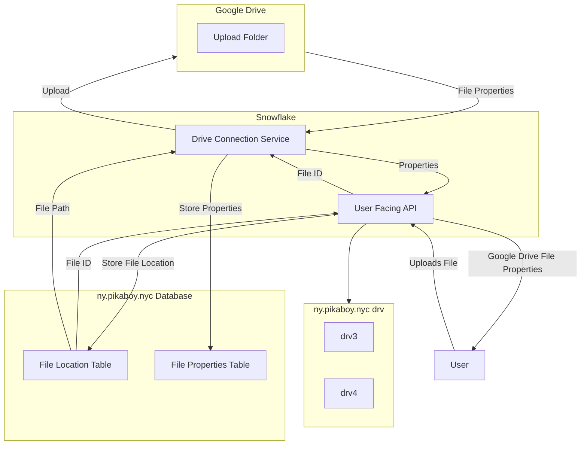

# Snowflake Master Plan

The idea of this master plan is to illustrate the structure of my Private File Service. This service is currently
only accessible via the Wireguard API. But eventually, authentication/authorization features will be implemented
to scrutinize inbound and outbound progress. 

### Master Plan Breakdown
Here is a breakdown of how the steps take place (as of 08/26/2023):
1) The user uploads the file via HTTP to the User Facing API.
2) The User Facing API will take that Multipart File and use Storage Service to save the data to drv (storage).
3) At the same time, when the storage process is complete, an entry is made w/ file path and unique UUID.
4) The UUID is forwarded to the Drive Connection Service in order to retrieve the data from the File Location Table.
5) Using the location, the Drive Connection Service uses the Google API to upload the File onto Google Drive.
6) Upon successful upload, the Drive Connection Service should retrieve some properties about the file to store in the 
File Properties Table
7) The File Properties is then forwarded to the User Facing API for filtering and returning a response to the user with
with information about the file uploaded. 